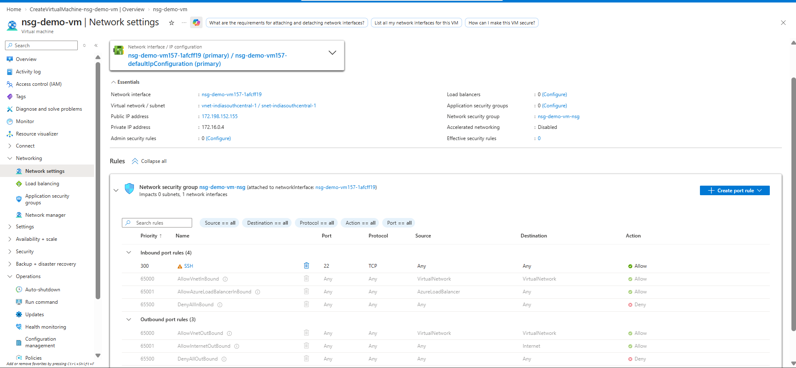
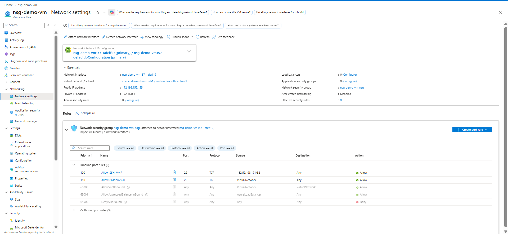
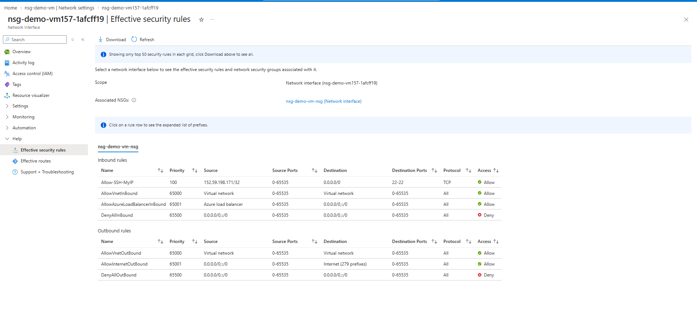
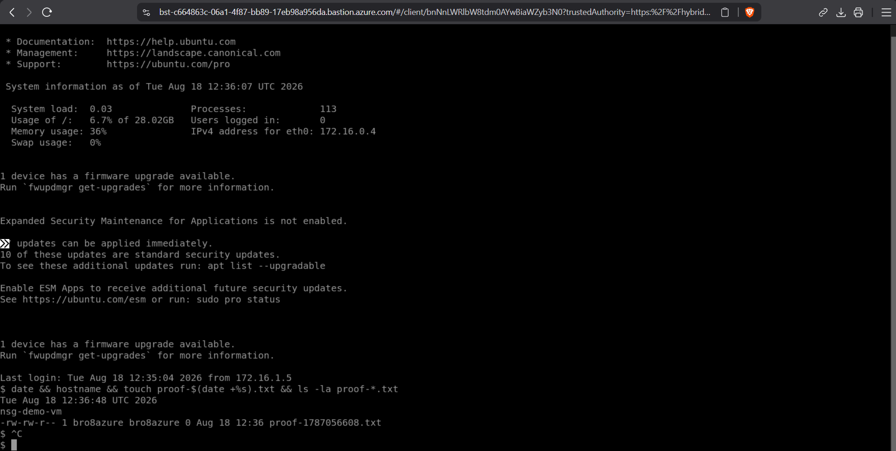
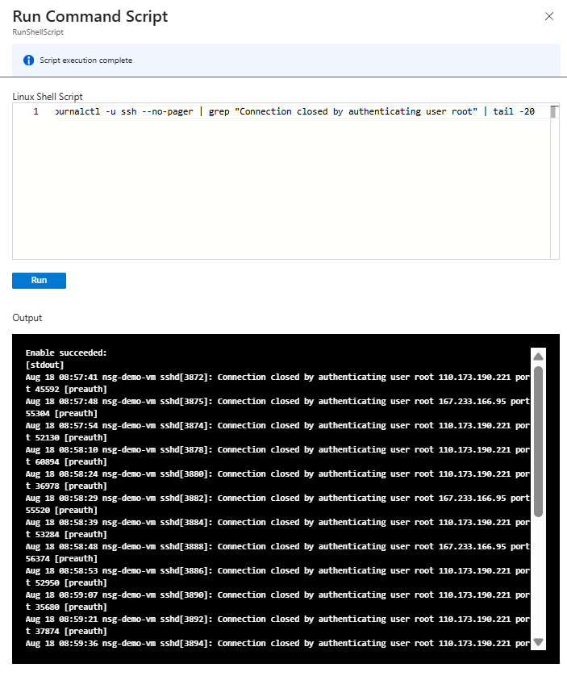

   # Securing an Azure VM with Network Security Groups (NSG)

## Objective
Deploy an Azure VM, then apply least-privilege network access control by restricting inbound SSH to a single trusted IP — and prove, with real evidence, that the restriction actually works.

## What I Built
- Ubuntu 24.04 VM (`nsg-demo-vm`) on Azure, Standard B1s (free-tier eligible)
- Custom Network Security Group rule (`Allow-SSH-MyIP`) allowing inbound SSH (port 22) from only my public IP, with all other inbound traffic denied by default

## Before: Open by Default
By default, Azure suggests allowing SSH from any source (`0.0.0.0/0`) — exposed to the entire internet.

## After: Locked to a Single IP
I restricted the rule so only my specific IP (`/32`) is allowed to reach port 22. Every other inbound request is dropped by the default deny-all rule.

Verified via Azure's "Effective security rules" view, confirming no conflicting rules at the subnet or NIC level:

## Proof the Lockdown Actually Works
Direct SSH from my own network failed — not from a misconfiguration, but because my mobile carrier (Jio) blocks outbound non-standard ports, including 22, at the network level (confirmed via `Test-NetConnection` timeouts on both port 22 and a test alternate port 2222).

To verify the VM and NSG rule were working correctly regardless, I connected through **Azure Bastion** (browser-based access over HTTPS/443, which bypasses local ISP port restrictions entirely) and captured a timestamped, unfakeable proof of a live session:

## Real-World Validation: This Matters
Within minutes of the VM's initial deployment during the brief window before the NSG rule was locked down, sshd logs already showed automated bots from multiple IPs attempting to brute-force root login. Their login attempts failed (wrong credentials), but the speed at which they found and targeted the VM demonstrates why leaving SSH open to the internet, even briefly, is a real risk and validates the importance of the lockdown that followed:

This wasn't a hypothetical threat — it's what happens to any internet-facing SSH port within hours, and it's exactly what this NSG rule prevents.

## Lessons Learned
- **ISP-level port blocking is real**: my mobile carrier silently blocked outbound SSH traffic, which looked identical to a misconfiguration until isolated through systematic testing (NSG effective rules → VM firewall (ufw) → sshd status → raw TCP reachability).
- **Ubuntu 24.04 uses systemd socket activation for SSH**: changing `Port` in `sshd_config` alone doesn't change the listening port — the socket unit (and, on Azure images, an auto-generated override in `/run/systemd/generator/`) controls it. Both had to be corrected to match.
- **Bastion connects via the VNet, not your public IP rule**: it needed its own NSG allowance (source: VirtualNetwork) separate from the IP-restricted rule, since Bastion traffic originates inside Azure's network, not from my own public IP.

## Cleanup
Bastion and its associated NSG rule were removed after verification to avoid ongoing cost. The VM was stopped/deallocated between work sessions.