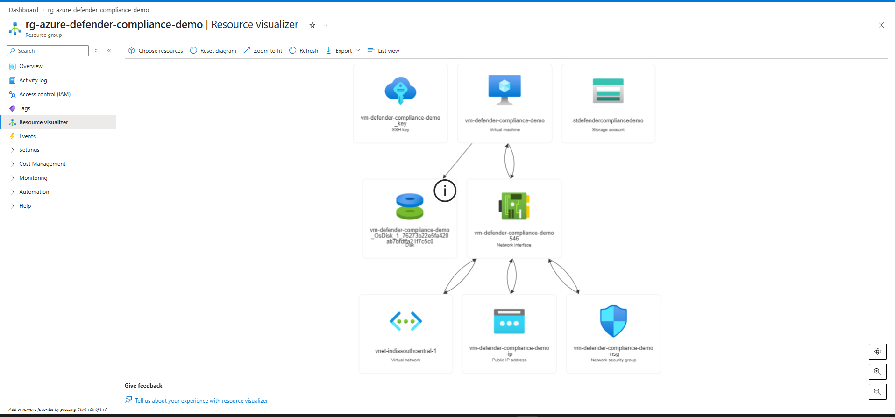
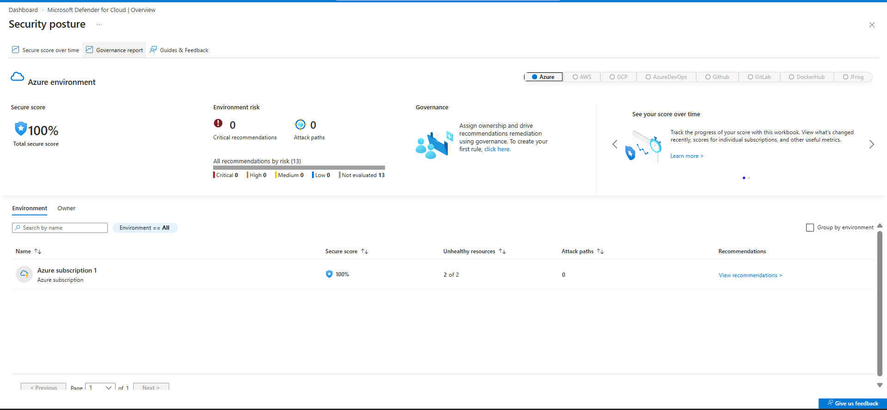
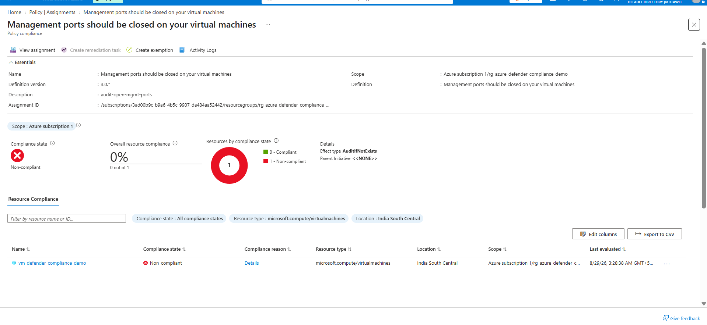
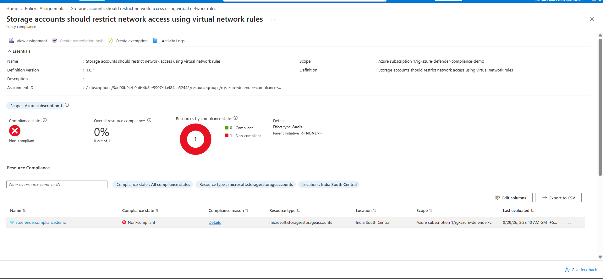
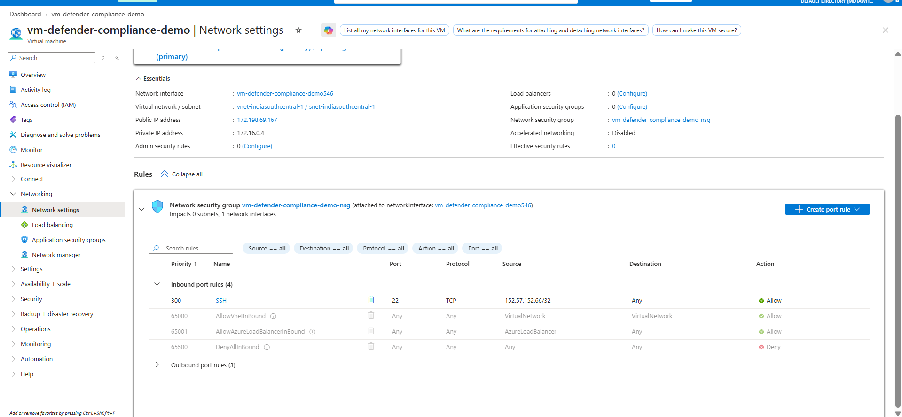
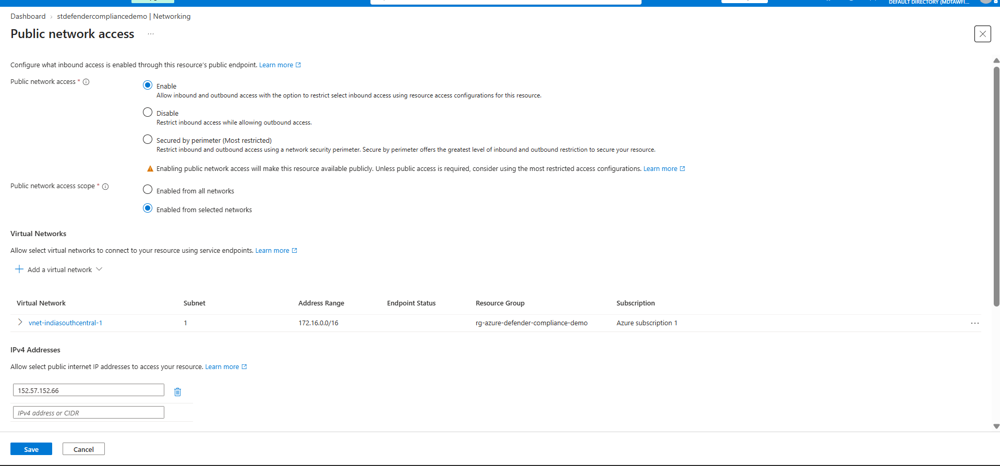
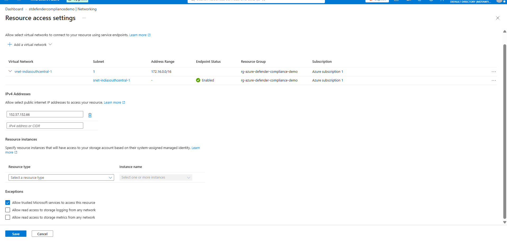
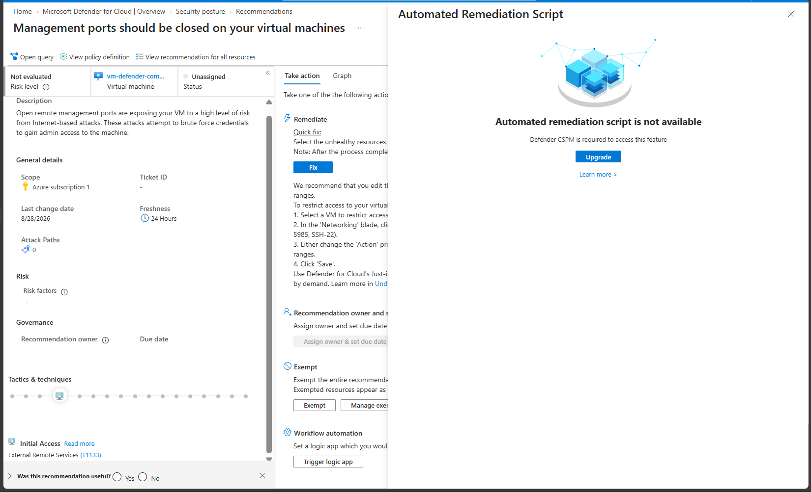
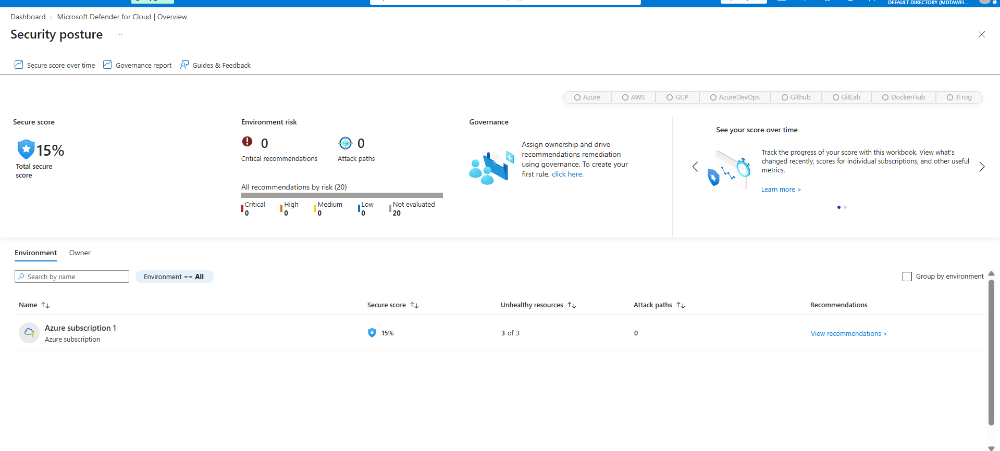

# Azure Defender for Cloud: Compliance and Posture Management

## What this project is about

Most cloud security work isn't about stopping one dramatic attack. It's about finding the small, boring misconfigurations that quietly leave a door open, and fixing them before someone else finds them first. This project is exactly that.

I deployed a small Azure environment on purpose with three real security gaps in it. Then I used Microsoft Defender for Cloud to find those gaps, confirmed them with Azure Policy, and fixed what I could. One issue couldn't be fully fixed here because it depends on a service I haven't built yet (Azure Key Vault), so I documented that honestly instead of faking a fix.

## What I built

- A resource group: `rg-azure-defender-compliance-demo`
- A Linux VM: `vm-defender-compliance-demo` (Ubuntu 22.04, Standard_B1s)
- A storage account: `stdefendercompliancedemo`
- Microsoft Defender for Cloud, enabled on the Foundational CSPM plan (free tier)

Here is the resource layout, pulled straight from Azure's own visualizer:

## The three misconfigurations

I set these up on purpose, so Defender for Cloud would have real things to find.

1. **Open management port.** The VM's SSH port (22) was open to any source on the internet, not just my own IP.
2. **No disk encryption.** The VM's disk was left on default settings, without Azure Disk Encryption or EncryptionAtHost turned on.
3. **Public storage access.** The storage account allowed anonymous blob access and public network access from any network.

## Compliance framework

I targeted the **CIS Microsoft Azure Foundations Benchmark**, since it's one of the most widely recognized standards and is built into Defender for Cloud as a toggle-on standard.

## How I found the issues

I enabled Defender for Cloud and let it run its first assessment. The Secure Score started at a misleading 100%, but that was only because most checks were still marked "not evaluated," not because the environment was actually clean.

A few hours later, the score dropped to a real 11%, with all three resources flagged as unhealthy. That's when the actual findings showed up:

1. **Management ports should be closed on your virtual machines**
2. **Linux virtual machines should enable Azure Disk Encryption or EncryptionAtHost**
3. **Storage accounts should restrict network access using virtual network rules**

One thing worth knowing: Defender for Cloud's "Risk level" column (Critical, High, Medium, Low) is locked behind the paid Defender CSPM plan. The free Foundational CSPM plan still gives you the full Secure Score, the named recommendations, and policy based compliance tracking, which is everything this project actually needed.

## Confirming the findings with Azure Policy

Instead of relying only on the Secure Score page, I assigned the matching built-in Azure Policy for each finding, scoped to my resource group. This gave me an independent, second confirmation of each issue, and it's also how real organizations track compliance at scale.

| Finding | Policy assigned | Result before fixing |
|---|---|---|
| Open SSH | Management ports should be closed on your virtual machines | Non-compliant, 0% |
| No disk encryption | Linux virtual machines should enable Azure Disk Encryption or EncryptionAtHost | Non-compliant, 0% |
| Public storage access | Storage accounts should restrict network access using virtual network rules | Non-compliant, 0% |

## Fixing the issues

### Fixed: Open SSH port

I edited the VM's network security group rule and changed the source from "Any" to my own IP address only. This closes the door to the rest of the internet while keeping my own access working.

### Fixed: Public storage access

I changed the storage account's public network access from "Enabled from all networks" to "Enabled from selected networks," and added the project's virtual network and my own IP as the only allowed sources.

### Deferred: Disk encryption

This one I couldn't cleanly fix inside this project's scope, and I want to be upfront about why instead of hiding it.

I looked at two ways to fix it:

- **Encryption at host**, which didn't support my VM's size in this subscription.
- **Classic Azure Disk Encryption**, which needs an existing Azure Key Vault to store the encryption keys. I don't have one yet.

Rather than rushing a workaround, I'm deferring this to Project 4, where building a Key Vault is the actual point of the project. This is a realistic example of how one security fix can depend on another piece of infrastructure being in place first, and that dependency chain is worth showing, not hiding.

## A note on timing

After fixing the SSH rule and the storage access, the Azure Policy dashboard kept showing "Non-compliant" for a while, even though the actual settings were already correct. I dug into this and found the reason: this specific policy is backed by a Microsoft Defender for Cloud security assessment, and those assessments refresh on their own schedule, sometimes taking many hours to catch up with a real change. I verified both fixes directly at the resource level instead of waiting on the dashboard, since that's the more reliable source of truth.

I also tried Defender's one click "Quick Fix" button, and found out it requires the paid Defender CSPM plan. The free tier doesn't include one click automated fixes, only detection and manual remediation guidance, which is exactly what I used instead.

By the next check, Secure Score had climbed to 15%, with the assessment engine now tracking 20 recommendations instead of the original 13, confirming it was still actively expanding its evaluation of the environment.

## Summary

- Found 3 real misconfigurations using Microsoft Defender for Cloud's Secure Score
- Confirmed all 3 independently using Azure Policy compliance checks
- Fixed 2 of 3 directly at the resource level
- Deferred 1 (disk encryption) to Project 4, with a clear, honest reason why
- Targeted the CIS Microsoft Azure Foundations Benchmark as the compliance framework

## Lessons learned

- A high Secure Score early on doesn't always mean your environment is secure. It can just mean the checks haven't finished running yet.
- Free tier tools can still get real security work done. The paid tier mainly adds automation and prioritization, not the core ability to find and understand problems.
- Dashboards lag behind reality. If you want to know the true current state of a resource, check the resource itself, not just the monitoring tool watching it.
- Some fixes depend on other infrastructure. Recognizing and documenting that dependency is more valuable than forcing a fake fix.