# Project 5: Securing Azure Cosmos DB with RBAC, Private Endpoints, and Encryption (Deployed via Terraform)

## Overview
This project deploys an Azure Cosmos DB account entirely through Terraform (Infrastructure as Code) rather than the Azure Portal, then secures it end-to-end: network isolation via a Private Endpoint, least-privilege access via Cosmos DB's built-in RBAC, and encryption verification. Every control was deployed as part of the initial configuration rather than patched in afterward, and every claim below is backed by a screenshot showing the actual result, not just the setting being toggled.

This is also the first project in the portfolio built with Infrastructure as Code instead of manual Portal clicks, which means the entire deployment is reproducible from the `.tf` files in this folder.

## Objective
- Deploy Azure Cosmos DB using Terraform instead of manual Portal configuration
- Eliminate public network exposure using a Private Endpoint plus a VNet
- Enforce least-privilege access using Cosmos DB's built-in data-plane RBAC roles
- Confirm encryption at rest and in transit
- Independently verify every control in the Portal, not just trust the Terraform output

## Architecture
The Cosmos DB account has public network access disabled from the moment it's created. The only path in is through a Private Endpoint, which sits inside a dedicated subnet of a Virtual Network. A network interface connects the Private Endpoint to Cosmos DB's private IP.

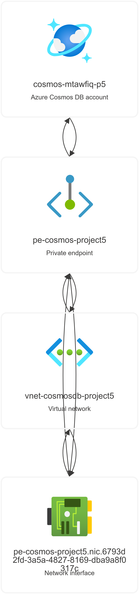

## Skills & Technologies Demonstrated
Terraform (Infrastructure as Code), Azure Cosmos DB, RBAC / least-privilege access, Private Endpoints, VNet, encryption at rest and in transit, Azure App Registrations / Service Principal authentication, Azure CLI, security verification and independent testing

## Step-by-Step Walkthrough

### 1. Environment Setup
Terraform was installed manually (Chocolatey ran into a permissions/lock-file conflict, so the binary was installed directly and added to PATH). The Azure provider was configured in `providers.tf`.

### 2. Authentication: a real finding, not a footnote
The original plan was to authenticate Terraform via `az login`. This tenant enforces Microsoft's Security Defaults policy, which requires MFA, but the account had no MFA method registered yet. Device-code login was also blocked outright by that same policy (Security Defaults disables it as a weaker auth method).

Registering an MFA method (a device-bound Passkey via Windows Hello) didn't fully resolve it either. Azure CLI's browser-based login still failed to complete the MFA challenge, even after enabling the CLI's WAM broker.

Rather than keep fighting an interactive login flow, I switched to the approach production pipelines actually use: a **Service Principal** (`terraform-project5-sp`), created via an App Registration, granted the **Contributor** role scoped to the subscription, authenticated through `ARM_*` environment variables. This sidesteps interactive MFA entirely and is a more accurate reflection of how Terraform is authenticated in real CI/CD environments, so the detour ended up producing a better final setup than the original plan.

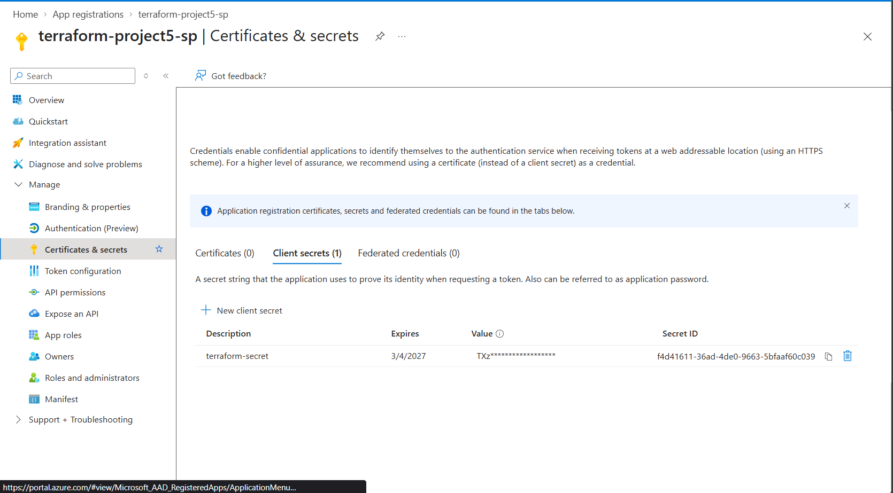


### 3. Deploying Cosmos DB via Terraform
`main.tf` defines the resource group and the Cosmos DB account (`GlobalDocumentDB`, Session consistency), with `public_network_access_enabled = false` set from the start, not toggled off after the fact.

```hcl
resource "azurerm_cosmosdb_account" "cosmos" {
  name                = "cosmos-mtawfiq-p5"
  location            = azurerm_resource_group.rg.location
  resource_group_name = azurerm_resource_group.rg.name
  offer_type          = "Standard"
  kind                = "GlobalDocumentDB"

  consistency_policy {
    consistency_level = "Session"
  }

  geo_location {
    location          = azurerm_resource_group.rg.location
    failover_priority = 0
  }

  public_network_access_enabled = false
}
```

`terraform plan` was reviewed before every `apply`. Nothing was deployed blind.

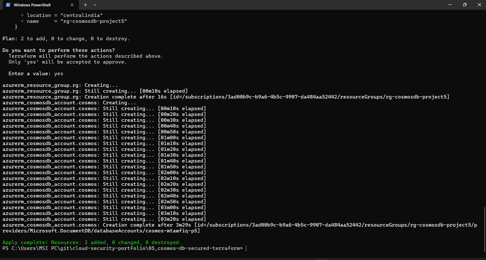

### 4. Securing Network Access: Private Endpoint + VNet
A VNet and subnet were added, then a Private Endpoint connecting that subnet directly to the Cosmos DB account:

```hcl
resource "azurerm_private_endpoint" "cosmos_pe" {
  name                = "pe-cosmos-project5"
  location            = azurerm_resource_group.rg.location
  resource_group_name = azurerm_resource_group.rg.name
  subnet_id           = azurerm_subnet.subnet.id

  private_service_connection {
    name                           = "psc-cosmos-project5"
    private_connection_resource_id = azurerm_cosmosdb_account.cosmos.id
    subresource_names              = ["Sql"]
    is_manual_connection           = false
  }
}
```

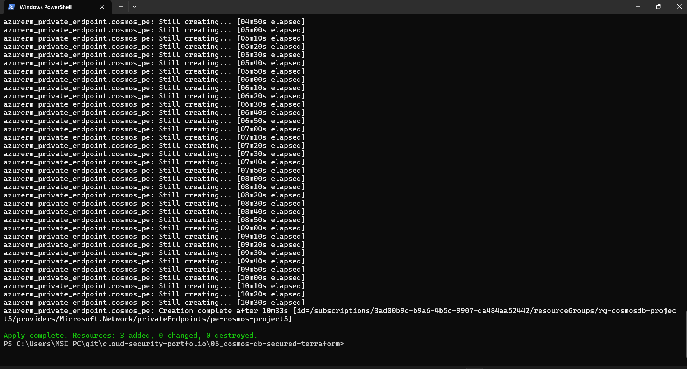

### 5. Configuring RBAC
Cosmos DB uses its own data-plane RBAC, separate from general Azure RBAC. The Service Principal was assigned Cosmos DB's built-in **Data Reader** role (read-only, a deliberate least-privilege choice, since this project's scope doesn't require write access), scoped only to this Cosmos account:

```hcl
resource "azurerm_cosmosdb_sql_role_assignment" "reader_assignment" {
  resource_group_name = azurerm_resource_group.rg.name
  account_name         = azurerm_cosmosdb_account.cosmos.name
  role_definition_id   = "${azurerm_cosmosdb_account.cosmos.id}/sqlRoleDefinitions/00000000-0000-0000-0000-000000000001"
  principal_id         = data.azurerm_client_config.current.object_id
  scope                = azurerm_cosmosdb_account.cosmos.id
}
```

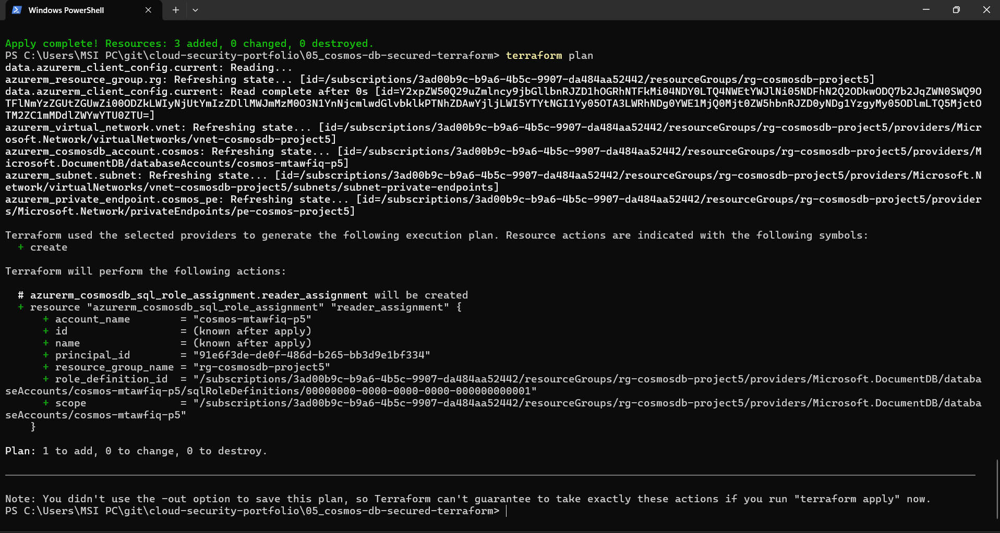
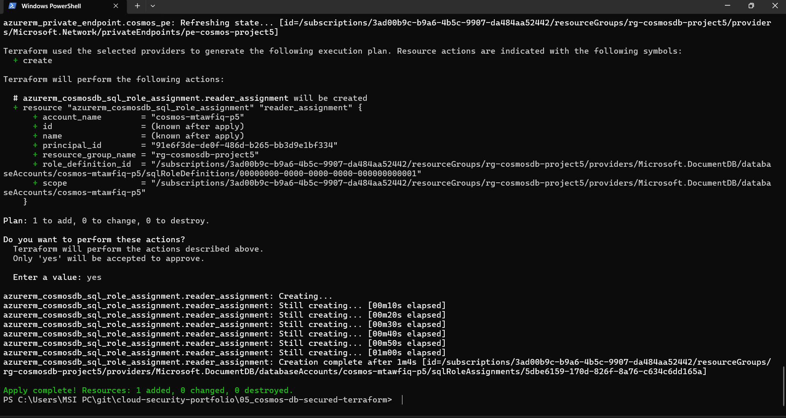

### 6. Verifying Encryption
Cosmos DB encrypts data at rest by default using Microsoft-managed keys. There's nothing to configure, only to verify. Customer-Managed Keys (CMK) were considered and deliberately not used; service-managed keys are the appropriate default for this project's scope. Encryption in transit is enforced automatically via TLS 1.2+ on all connections, with no toggle to demonstrate.

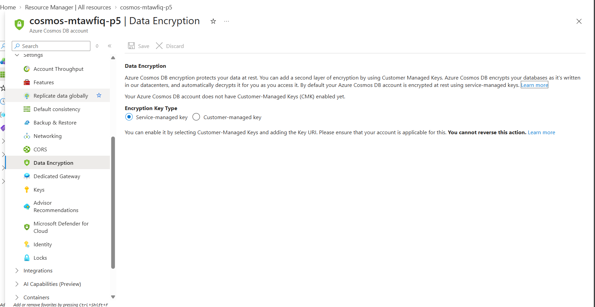

## Verification & Testing
Every control was independently confirmed in the Portal, not just assumed to have worked because Terraform said so:

- **Public access blocked:** Networking blade shows "Disabled," with Azure's own confirmation: *"No public traffic will be able to access this resource."*
- **Private Endpoint connected:** Private access tab shows the connection state as **Approved**.
- **RBAC assignment real:** `terraform state show` confirms the role assignment exists with a live assignment ID, scoped exactly to this Cosmos account.
- **Full resource inventory:** the resource group contains exactly the 4 resources expected: Cosmos DB account, VNet, Private Endpoint, and its network interface. Nothing extra, nothing missing.

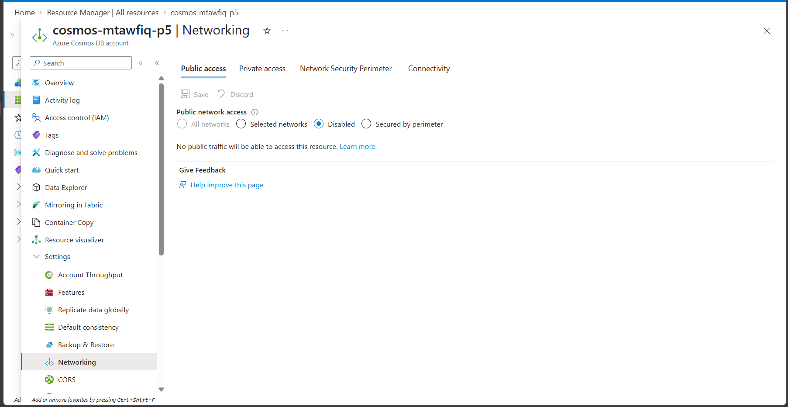
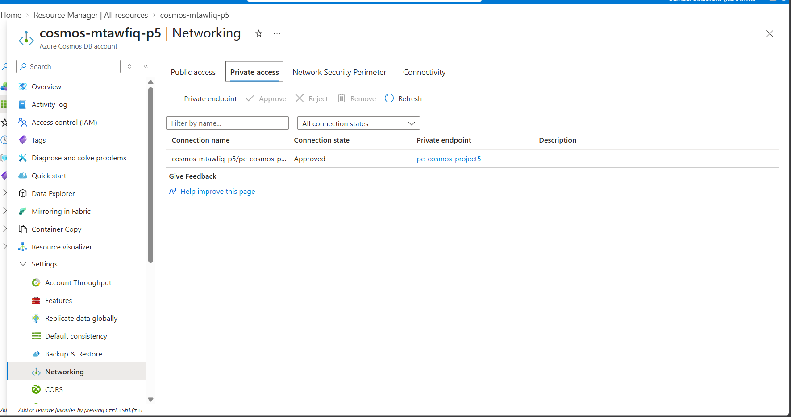
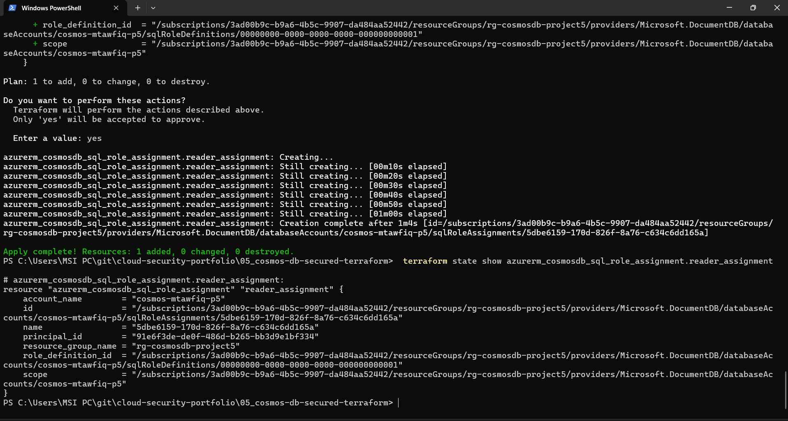
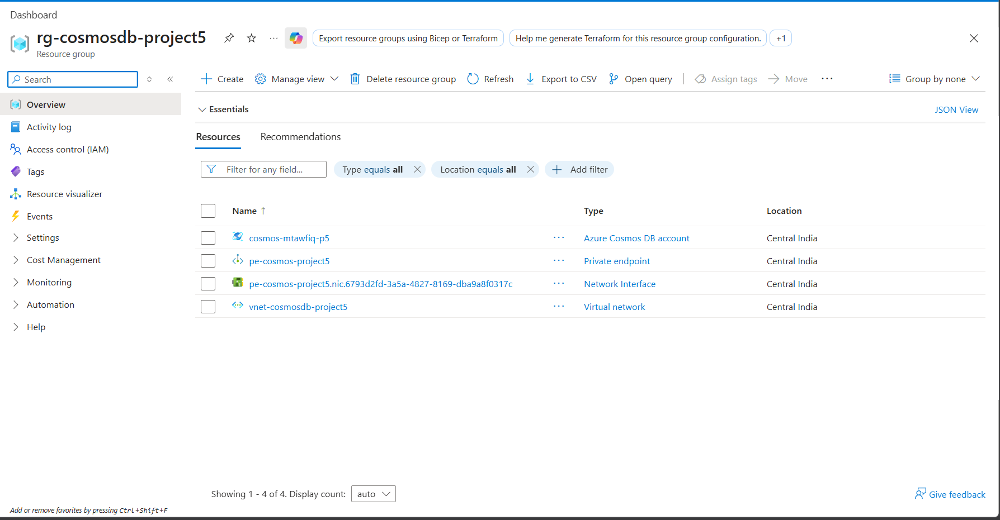

## Key Findings
- **Tenant-level MFA policy can silently block automation.** Interactive Azure CLI login isn't a reliable auth method once an org enforces Security Defaults. Service Principal authentication is the correct approach for infrastructure automation regardless, and this project ended up demonstrating that "right way" rather than the workaround.
- **Secure-by-design vs. secure-by-remediation.** Unlike Project 3 (where misconfigurations were found and then fixed), this project's controls were correct from the first `terraform apply`, a stronger security posture story, and a good illustration of what "shift-left" security looks like in practice.

## Cleanup
Resource group deleted same day after documentation was completed, per portfolio discipline of avoiding idle Azure credit burn.

## Author
Mohammad Tawfiq Ali
- GitHub: [MohammadTawfiq](https://github.com/MohammadTawfiq)
- LinkedIn: [in/businesswithmohammad](https://linkedin.com/in/businesswithmohammad)