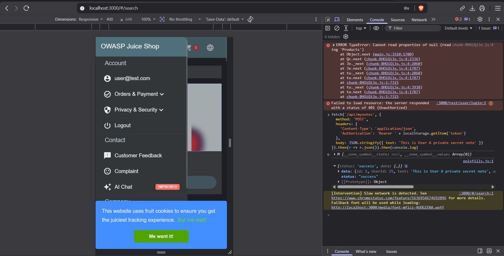
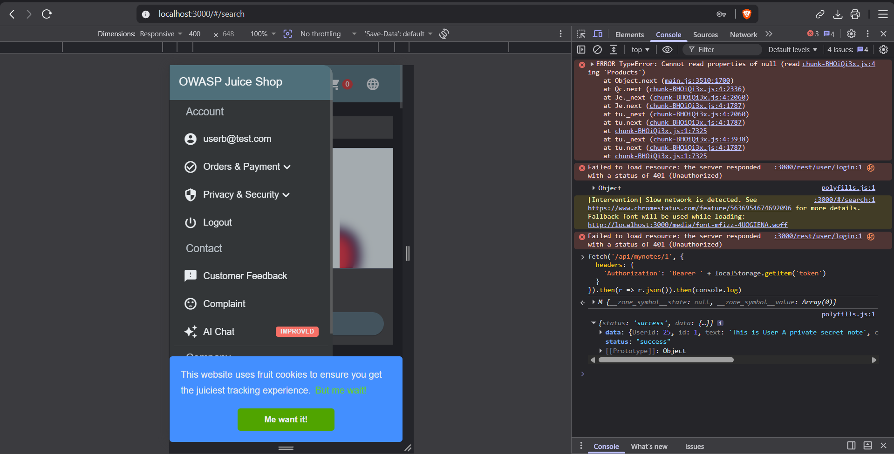
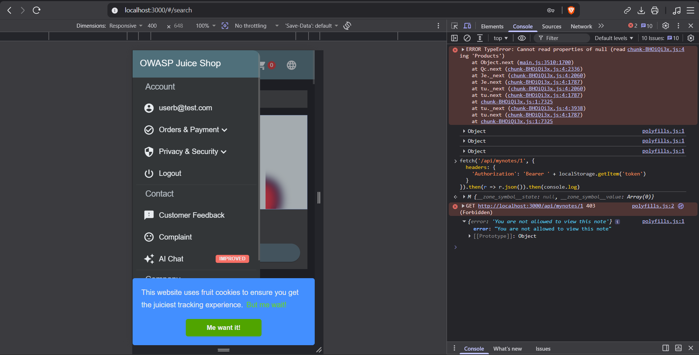

# OWASP Juice Shop — Custom IDOR Vulnerability (A01:2021 Broken Access Control)

## Objective
Fork OWASP Juice Shop, add a custom "private notes" feature containing an intentional IDOR (Insecure Direct Object Reference) vulnerability, exploit it to prove real impact, then patch and re-verify the fix — demonstrating the full attack-and-defense cycle for this OWASP Top 10 category.

## What I Built
- A new `Note` model (`UserId`, `id`, `text`) and a `/api/mynotes/:id` endpoint on a forked, locally-run instance of Juice Shop.
- The endpoint initially fetched a note purely by its ID — with no check that the requester actually owned it, mirroring the same flaw already present in Juice Shop's own basket endpoint.

## The Vulnerability
```ts
export function retrieveNote () {
  return async (req: Request, res: Response, next: NextFunction) => {
    const id = req.params.id
    const note = await NoteModel.findOne({ where: { id } })
    res.json(utils.queryResultToJson(note))
  }
}
```
Any authenticated user could fetch **any** note by simply changing the ID in the URL — the app trusted the ID and never checked who was asking.

## Proof of Exploit
1. Logged in as **User A**, created a private note:



2. Logged in as a completely separate account, **User B**, and requested that same note by ID:



User B — who never created or owned this note — received its full private content. This confirms a real, exploitable Broken Access Control vulnerability.

## The Fix
```ts
export function retrieveNote () {
  return async (req: Request, res: Response, next: NextFunction) => {
    const id = req.params.id
    const user = security.authenticatedUsers.from(req)
    const note = await NoteModel.findOne({ where: { id } })

    if (note && user && note.UserId !== user.data.id) {
      res.status(403).json({ error: 'You are not allowed to view this note' })
      return
    }

    res.json(utils.queryResultToJson(note))
  }
}
```
The fix compares the note's actual owner (`note.UserId`) against the logged-in requester (`user.data.id`). If they don't match, the request is rejected with a `403 Forbidden` before any data is returned.

## Proof the Fix Works
Repeating the exact same exploit attempt as User B, after the patch:



The request is now correctly blocked with `403 (Forbidden)` and `"You are not allowed to view this note"` — no data leaked.

## Lessons Learned
- **Ownership checks must be explicit** — simply requiring a user to be logged in is not the same as verifying they own the specific resource they're requesting. Juice Shop's own basket endpoint has this exact same flaw by design, which is what I modeled this vulnerability on.
- **TypeScript compilation is a separate step from running the app** — Juice Shop runs from a compiled `build/` folder, so changes to `.ts` source files require `npm run build:server` before `npm start` will reflect them.
- **Test data doesn't persist across restarts** — Juice Shop rebuilds its database from scratch on every server start, so exploit testing has to happen within a single continuous session.

## Setup
Forked and run locally via `npm install && npm run build:server && npm start`, tested using the browser DevTools console to send authenticated requests as two separate user accounts.